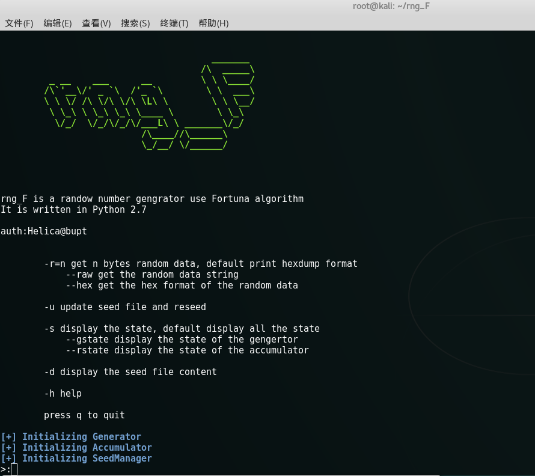
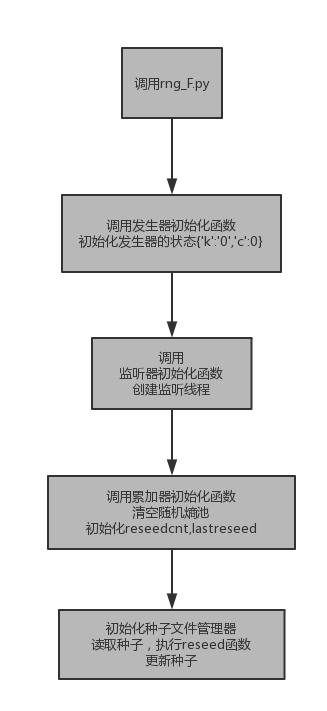
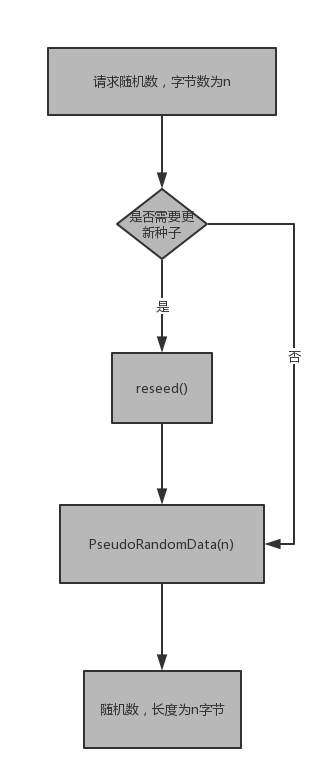
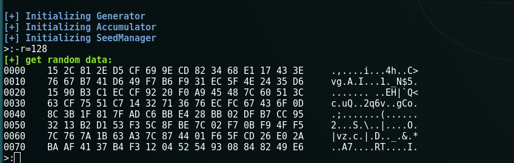
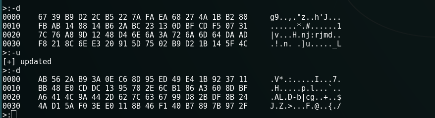
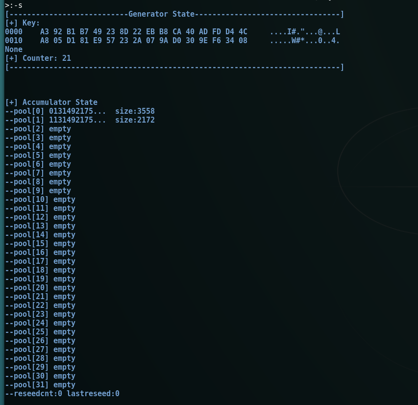

#Fortuna随机数生成器设计文档

###1. 需求分析

本次实验要求编写Fortuna算法的随机数生成器，算法逻辑在ppt中已经给出，所以需求分析比较简单明了。

1. 按照ppt中的伪代码编写
2. 开发难度低，开发速度快
3. 对代码效率无明显要求

###2. 整体架构设计

首先是语言和环境的选择

1. 由于要求开发的速度快，而性能没有明确的要求，选择了python语言，省去了c/c++多余的复杂处理。
2. 操作系统选择了linux，由于linux可以更轻松的获得系统参数，以生成熵池。
3. 选择了面向对象的开发模式。生成器，累加器和种子文件管理编写为3个类，由主文件调用。

结构图如下：

###3. 详细设计

主py文件负责调用三个类，并处理用户的输入。
首先是初始化的流程，初始化过程将从种子文件中获取种子，并打开监听线程收集系统的随机熵。
下图展示了初始化过程：

下图展示了请求随机数的流程：

###4. 使用说明
输入指令指令
 - -r=n 获得n字节随机种子。--raw以原字符串输出，--hex以16进制字符串输出，默认将以混合模式输出。
 
 
 

 - -u 更新种子文件和发生器状态。
 
 - -s  输出状态。--gstate输出发生器状态，--rstate输出累加器状态，默认输出两种状态。
 
 - -d 输出种子文件的内容。
 

